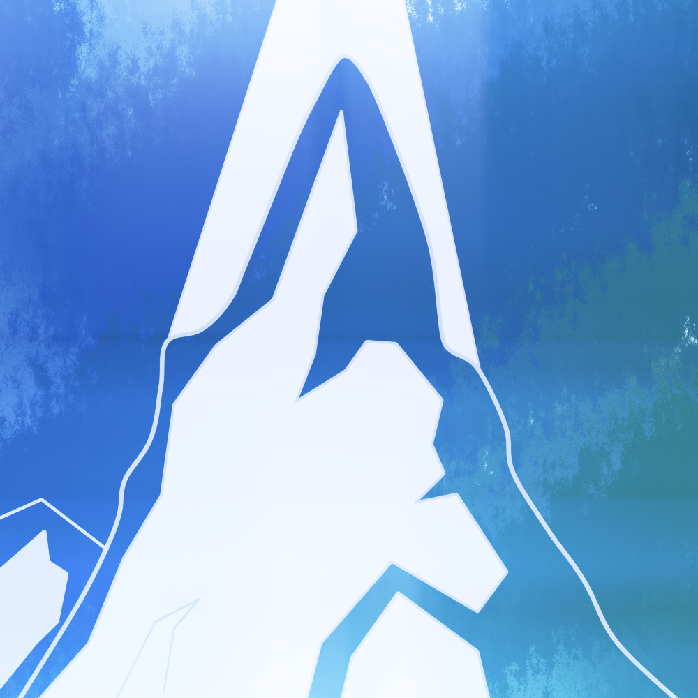
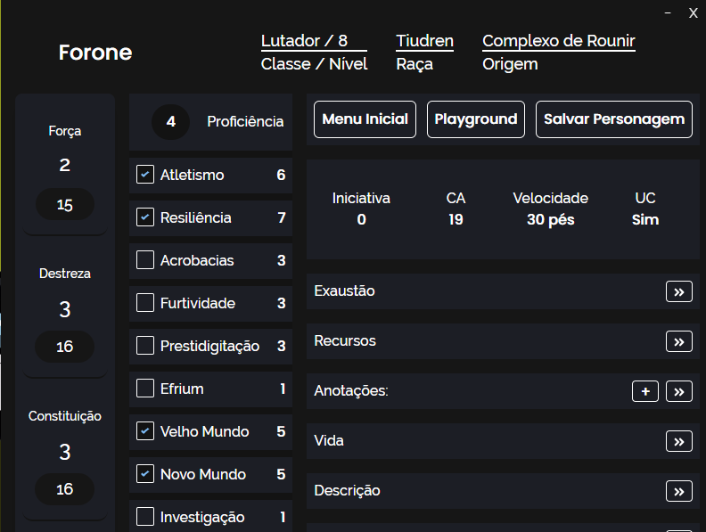
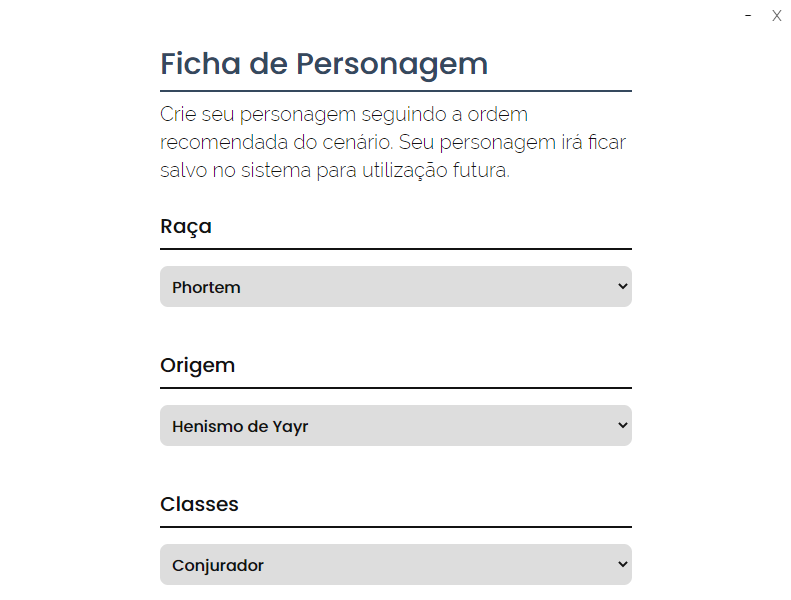

<!-- PROJECT LOGO -->
<br />
<p align="center">
  <a href="https://novout.github.io/frost-remnands/rpg/">
    
  </a>

  <h3 align="center">Restos da Geada - Aplicação Desktop</h3>
</p>
<!-- TABLE OF CONTENTS -->

## Sobre o Projeto

Aplicação desktop para o RPG [Restos da Geada](https://novout.github.io/frost-remnands/), com a intenção de trazer uma experiência de compêndium satisfátoria.

## Conteúdo

- Tema claro/escuro
- Criação e carregamento de fichas de personagem
- Integração com as regras de Restos da Geada
- Playground

<p align="center">
<a href="https://novout.github.io/frost-remnands/rpg/">
  
</a>
</p>

<p align="center">
<a href="https://novout.github.io/frost-remnands/rpg/">
  
</a>
</p>

## Tecnologias

- Electron.js
- Vue.js + JSX
- TailwindCSS

<!-- GETTING STARTED -->

## Contribuir

Para fazer uma cópia e rodar o projeto localmente, siga estes passos:

### Pré-requisitos

Os programas a seguir são necessários para estender, modificar e utilizar o projeto.

- [Git](https://git-scm.com)
- [Node](https://nodejs.org/en/)
- [Yarn](https://yarnpkg.com/)

### Instalação

Clone o repositorio

```sh
git clone https://github.com/Novout/frost-remnands-desktop.git
```

Rode o projeto:

```js
yarn && yarn serve
```

Se precisar buildar a aplicação, siga:

```js
yarn && yarn icons && yarn build
```

<!-- CONTRIBUTING -->

## Como Contribuir

Contribuições fazem com que a comunidade open source seja um lugar incrível para aprender, inspirar e criar. Todas as contribuições
são **extremamente apreciadas**

1. Realize um Fork do projeto
2. Crie um branch com a nova feature (`git checkout -b feature/featureBraba`)
3. Adicione o Conteúdo (`git add -A`)
4. Realize o Commit (`git commit -m 'Adicionado conteudo brabo'`)
5. Realize o Push no Branch (`git push origin feature/featureBraba`)
6. Abra um Pull Request

## Colaboradores

Giovane Cardoso - Criador de Restos da Geada [@NovoutT](https://twitter.com/NovoutT) - novout@hotmail.com
